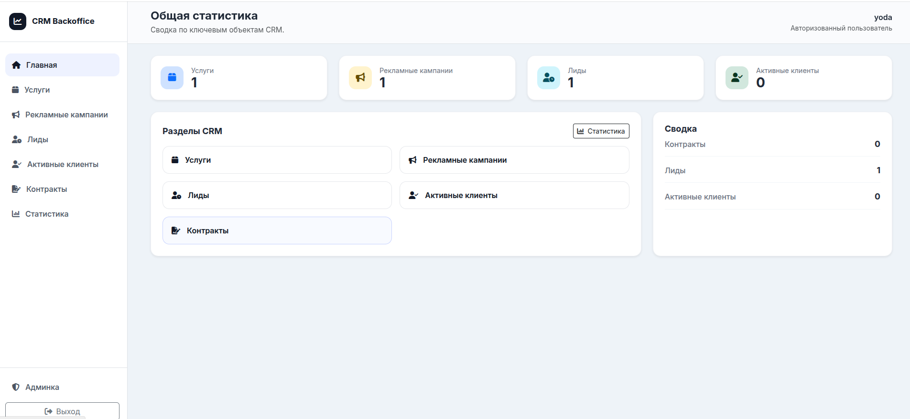

# 🚀 Django CRM

Учебно-боевой CRM-проект на Django для управления услугами, рекламными кампаниями, лидами, активными клиентами и контрактами.

## ✨ Что это

Этот репозиторий показывает полный server-rendered CRM-поток без SPA:

- 📦 каталог услуг;
- 📣 рекламные кампании и статистика;
- 👤 лиды и конверсия в активных клиентов;
- 🤝 клиенты и их контракты;
- 📄 загрузка файлов контрактов;
- 🔐 роли, permissions и админка.

Проект сделан как монолит на `Django 5.2 LTS` с акцентом на понятную архитектуру, строгую типизацию и автоматические проверки.

## 🖼️ Интерфейс



## 🧩 Для чего проект

CRM нужна для базового контура продаж:

1. маркетолог создает услугу и рекламную кампанию;
2. оператор заводит лиды из этой кампании;
3. менеджер конвертирует лид в активного клиента;
4. менеджер фиксирует первый и последующие контракты;
5. команда смотрит статистику по эффективности кампаний.

## 🛠️ Стек

- `Python 3.13`
- `Django 5.2.13 LTS`
- `Bootstrap 5.3`
- `SQLite` для локальной разработки
- `PostgreSQL` как целевая БД для Docker и production-окружения
- `pytest`, `mypy`, `ruff`, `pylint`

## 🔐 Роли

- `Superuser` — полный доступ к приложению и Django admin.
- `Operator` — работает с лидами.
- `Marketer` — работает с услугами и рекламными кампаниями.
- `Manager` — конвертирует лиды, ведет клиентов и контракты.

Подробно права и рабочие сценарии описаны в [docs/user-guide.md](docs/user-guide.md).

## ⚡ Быстрый старт

```bash
uv sync --group dev
cp .env.example .env
uv run python manage.py migrate
uv run python manage.py sync_roles
uv run python manage.py createsuperuser
uv run python manage.py runserver
```

После запуска приложение доступно по адресу `http://127.0.0.1:8000/`.

## 📚 Документация

- [Руководство пользователя и роли](docs/user-guide.md)
- [Архитектура проекта](docs/architecture.md)
- [План работ / roadmap](TODO.md)

## ✅ Контроль качества

Локальные проверки:

```bash
uv run --group dev ruff check .
uv run --group dev mypy
uv run --group dev pytest
uv run --group dev pylint apps django_crm manage.py
```

Для `pull request` в `dev` и `master` уже настроены автоматические проверки через GitHub Actions.
